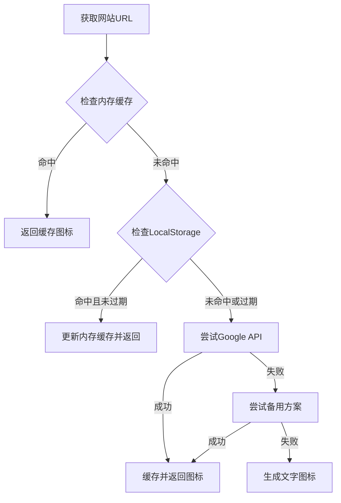

# 技术方案设计

## 架构概述

采用多级favicon获取策略，优先使用可靠的公共服务，备用本地代理方案，并实现缓存优化。

## 技术栈

- 前端：JavaScript (ES6+)
- 缓存：浏览器HTTP缓存 + CDN共享缓存 + Memory Cache
- 服务：Google Favicon API (主要) + 本地代理备用

## 技术选型

### 主要方案：Google Favicon API
```
https://www.google.com/s2/favicons?domain={domain}&sz=64
```

优势：
- 高可用性
- 支持HTTPS
- 免费使用
- 良好的缓存策略

### 备用方案：本地代理服务
如果Google服务不可用，使用本地服务器代理favicon请求：
```
/api/favicon?url={encoded_url}&size=64
```

## 数据库/接口设计

### 内存缓存
```javascript
const faviconCache = new Map(); // 内存缓存，避免重复请求
```

### HTTP缓存

成功结果由浏览器缓存24小时、CDN缓存7天；失败结果短暂缓存，避免持续请求无效域名。

## 测试策略

1. 单元测试：测试favicon URL生成逻辑
2. 集成测试：测试缓存机制和错误处理
3. E2E测试：测试实际页面中的图标显示

## 安全性

- 对输入URL进行验证和清理
- 使用encodeURIComponent防止注入攻击
- 设置合理的请求超时时间
- 限制单个域名的请求频率

## 性能优化

- 内存缓存减少网络请求
- LocalStorage持久化缓存
- 请求去重
- 懒加载策略
- 预加载常用网站favicon

## 流程图


